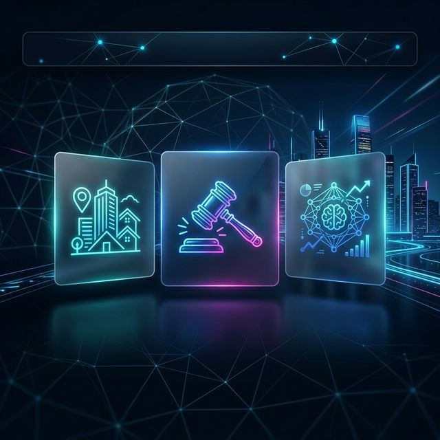
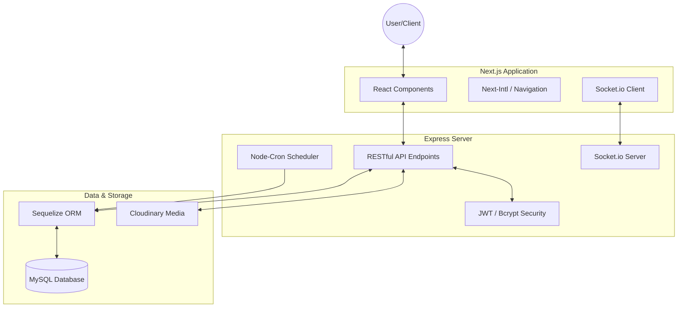

<div align="center">



# 🏆 Project SWD392 - Premium Auction & Real Estate Platform

[](https://nextjs.org/)
[](https://expressjs.com/)
[](https://sequelize.org/)
[](https://socket.io/)

**Redefining the digital auction experience with real-time speed and AI-driven precision.**

[Explore Features](#-key-features) • [Architecture](#-system-architecture) • [Getting Started](#-quick-start) • [Tech Stack](#%EF%B8%8F-tech-stack)

---

</div>

## ✨ Key Features

| Feature | Description | Icon |
| :--- | :--- | :---: |
| **Real-time Bidding** | Instant, low-latency bid updates powered by Socket.io. | ⚡ |
| **Luxury Auctions** | Specialized platform for high-end properties and assets. | 🏰 |
| **AI Insights** | Advanced property analysis and valuation powered by Gemini AI. | 🤖 |
| **Secure Payments** | Integrated checkout flow for auction winners and deposits. | 💳 |
| **Automated Timing** | Precision auction scheduling and completion via Node-cron. | 🕒 |
| **Global Ready** | Multi-language support using `next-intl` for a global audience. | 🌍 |

---

## 🏗️ System Architecture

Our platform is built on a modern, decoupled architecture designed for scale and responsiveness.



---

## 🛠️ Tech Stack

### Frontend
- **Framework**: [Next.js 15+](https://nextjs.org/) (App Router)
- **Styling**: [Tailwind CSS 4](https://tailwindcss.com/)
- **State/Real-time**: [Socket.io Client](https://socket.io/)
- **Icons**: [Lucide React](https://lucide.dev/)
- **Localization**: [Next-intl](https://next-intl-docs.vercel.app/)

### Backend
- **Framework**: [Express 5](https://expressjs.com/)
- **Real-time**: [Socket.io](https://socket.io/)
- **ORM**: [Sequelize](https://sequelize.org/) (MySQL)
- **Security**: [JWT](https://jwt.io/) & [BcryptJS](https://github.com/dcodeIO/bcrypt.js)
- **Automation**: [Node-cron](https://github.com/node-cron/node-cron)
- **Media**: [Cloudinary](https://cloudinary.com/) (Multer Integration)
- **Emails**: [Nodemailer](https://nodemailer.com/)

---

## 🚀 Quick Start

### Prerequisites
- [Node.js](https://nodejs.org/) (v18+)
- [MySQL](https://www.mysql.com/) database
- [Cloudinary](https://cloudinary.com/) account

### 1. Clone the Repository
```bash
git clone https://github.com/tunanhz/Project_SWD392.git
cd Project_SWD392
```

### 2. Configure Environment Variables
Create `.env` files for both frontend and backend based on the following examples:

**Backend (`./backend/.env`):**
```env
PORT=5000
DB_NAME=your_db
DB_USER=your_user
DB_PASS=your_password
JWT_SECRET=your_secret
CLOUDINARY_URL=your_cloudinary_url
```

### 3. Install Dependencies & Seed Database
```bash
# From the root directory
npm install
npm run seed --prefix backend
```

### 4. Launch the Platform
```bash
# Run both frontend and backend concurrently
npm run dev
```
- Frontend: `http://localhost:3000`
- Backend API: `http://localhost:5000`

---

## 📂 Project Structure

```text
Project_SWD392/
├── frontend/           # Next.js 15 Client
│   ├── src/app/        # App Router pages
│   ├── src/components/ # UI Components
│   └── public/         # Static assets
├── backend/            # Express Server
│   ├── src/controllers/# Business logic
│   ├── src/models/     # Sequelize definitions
│   └── src/routes/     # API endpoints
└── docs/               # Technical documentation
```

---

<div align="center">
Made with ❤️ by the Project Dương Tuấn Anh
</div>
